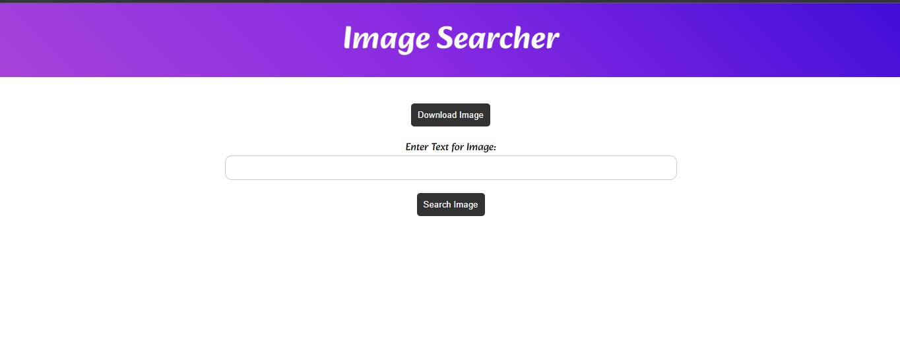

# Simple Image Search App 🖼️

This app allows you to search for free high-quality images powered by the Unsplash API. 

## ✨ Key Features

- Search for images by keyword 
- Responsive image gallery 
- Download images easily
- Clean and intuitive UI

## 🛠️ Built With

- NodeJS
- Unsplash API

## 🚀 Getting Started

### Prerequisites

- Node.js installed
- Unsplash API key 

## 🎨 Usage

1. Enter a search term in the input field 
2. Click "Search" or press Enter
3. Browse image results and click an image to download

## ✍️ Contributing

Contributions are welcome! Please open an issue or submit a PR for any enhancements.

## 📝 License

This project is open source and available under the [MIT License](LICENSE).

## 🙋‍♂️ Contact

Let me know if you have any feedback or questions!

